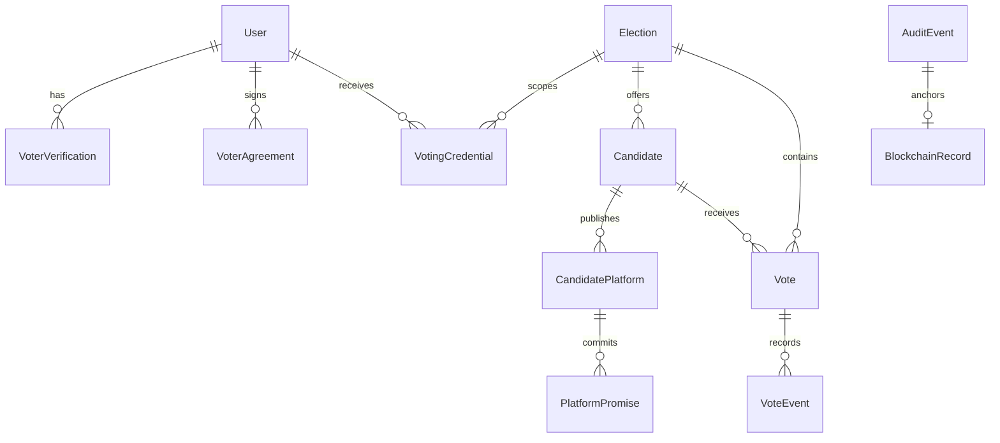

# Database design

PostgreSQL is the persistence engine. Prisma schema is authoritative for tables; SQL migrations add constraints and immutable-table triggers.

| Model | Purpose and constraints |
| --- | --- |
| User | Unique Telegram ID, random private voter key, session version |
| VoterVerification | Unique user/provider receipt; expiry and verified status; keyed unique-subject commitment prevents a second account using the same provider identity |
| TelegramAuthReplay | One-time digest of a validated Telegram hash, with expiry; no raw initData or profile stored |
| VotingCredential | Unique user/election grant with random 256-bit token and optional legacy ballot pseudonym; token and identity link stay private |
| VoterAgreement | Unique user/document/version; exact text hash and private signature hash; also records platform endorsements |
| Election | Title, type, state, opening/closing dates and immutable post-activation recall policy |
| Candidate | Election FK, full name, fictional party, ideology, bio and withdrawal flag |
| CandidatePlatform | Candidate FK, version and canonical content hash |
| PlatformPromise | Platform FK, description, status, progress 0..100, evidence note |
| Vote | Unique election/pseudonym; candidate/election composite FK; integer balance 0..100 |
| VoteEvent | Immutable CAST +100 or RECALL by a permitted negative integer amount; unique ballot/request key |
| AuditEvent | Immutable salted commitment, previous hash, own hash, sequence and optional election scope |
| BlockchainRecord | Unique audit event, commitment, MOCK adapter, pending/processing/confirmed/failed receipt with claim lease |
| AdminGrant | Private election-manager role assigned from a trusted operator shell |
| RateLimitCounter | Shared PostgreSQL window counter keyed by a hash of action and subject |

## Relationships

User → verification, agreements and election-scoped credentials. Election → candidates, votes and credentials. Candidate → versioned platforms → promises. Vote → immutable events. AuditEvent → one mock blockchain receipt. Votes do not have a User foreign key or credential foreign key. The voting pseudonym is derived using a standard HMAC over the private credential token and election ID.

## Mutation guarantees

Casting creates the ballot, +100 event, audit commitment and outbox entry in a serializable transaction. The unique election/pseudonym constraint rejects racing duplicate casts. Recall reads a locked ballot, sums immutable events, checks the projection, subtracts the authorized amount and appends the negative event in the same transaction. A per-citizen advisory lock serializes eligibility-sensitive writes with document signing. Request IDs and request hashes make retries idempotent and reject changed payloads. Serialization/deadlock conflicts retry a bounded number of times, including SQLSTATE 40001/40P01 nested in PostgreSQL adapter metadata.

Triggers forbid updating/deleting vote events and audit events and prevent balance/event divergence at commit. SQL checks protect valid event units, balances, promise progress and election dates. Database-owner access can defeat these protections; production requires isolated migration and runtime roles, backups and independent audit replication.

Platform versions and signed agreements are immutable. BEFORE TRUNCATE triggers protect ballots and evidence tables. Audit insert triggers verify monotonic sequences, previous links and the SHA-256 chain hash with PostgreSQL's built-in hash function. Outbox commitments must match their immutable audit record and cannot be changed or deleted.

Migration `202610080004_auth_credentials` adds auth-replay and credential tables plus the optional provider subject commitment. Migration `202610080005_credential_integrity` makes issued credentials immutable and blocks truncation. Migration `202610080006_identity_commitment_integrity` prevents a verified provider subject from being replaced or deleted; legacy null commitments can be filled on first re-verification. Older Vote rows are not rewritten: `/api/me` reads their previous election pseudonym until the user next writes, when a credential records that legacy pseudonym. New ballots use random credential tokens. The original immutable event, audit, balance, and duplicate-ballot constraints remain in force.

## Seed

Three fictional elections (council, budget delegate, community representative), ten fictional candidates, versioned platforms and promises. Seed is idempotent and does not delete ballots or audit history. Synthetic support is not mixed into persisted ballots; a UI-only preview is labeled explicitly.

Migration 007 adds an `AdminGrant` role table, a soft-withdrawal flag for candidates and the future lifecycle enum values. Role assignment and administrative changes append audit records; existing migrations and ballot evidence are preserved.

Migration 008 maps existing `OPEN` elections to `ACTIVE` and `CLOSED` elections to `FINISHED`, then removes the legacy enum values. New elections default to `DRAFT`; the fictional seed elections activate after their candidates and platforms are created. Public reads calculate effective state from server time, and a voting transaction materializes `UPCOMING` to `ACTIVE` when it admits a ballot.

Migration 009 adds recall policy columns with default 25-unit behavior. It broadens the vote balance and recall-event SQL checks to integer units 0–100 and -1 through -100, while the service enforces each election's configured amount, delays and operation limit under locks. Existing immutable events and ballots are unchanged.

Migration 010 adds an optional election foreign key to future immutable `AuditEvent` records. New election management, voting, recall and platform-sign events set it. Older events remain unscoped in the global chain; the migration does not mutate append-only history.

Migration 011 adds the `PROCESSING` outbox state, claim token and lease expiry, plus a PostgreSQL rate-limit counter table. Workers atomically claim one attempt via conditional updates; only the matching claim token can finalize a record. The counter table stores hashed subjects supplied by the rate-limit service, not raw account identifiers. Expired counter cleanup is an operator maintenance task.

Migration 012 adds database triggers that freeze election configuration and recall policy once activated, reject invalid lifecycle transitions, and forbid election/candidate deletion. Candidate insertion and changes, new platform versions and new or retitled promises are allowed only while the election is a draft. Promise progress/evidence remain mutable after activation. Fresh migrations and direct-write regression tests validate these controls. Existing records are left in place.

Migration 013 takes a shared lock on the parent election before candidate, platform and promise triggers inspect its state. This serializes direct writes with activation so an insert cannot read a draft status and commit after activation.
